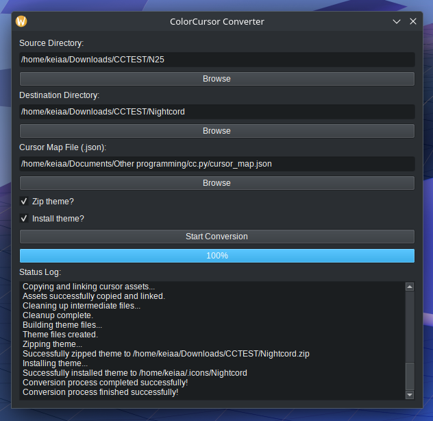

# cc.py

**cc.py** is a user-friendly GUI tool designed to convert Windows cursor themes (`.cur` and `.ani` files) into a format compatible with Linux desktop environments.

The application uses the `win2xcur` command-line utility and provides a graphical interface for managing the entire conversion process, including dependency setup, file mapping, and theme installation.

This project started out with `safeusernameig`, when they inquired our forum about converting Project Sekai cursors for use in Linux Mint. It started out as a simple bash script but has since then been reconsidered to be built as a modular Python application using PyQt6.

## Features

- **GUI interface:** A clean and intuitive graphical user interface built with PyQt6.
- **Dependency management:** Automatically sets up a Python venv and installs the necessary deps.
- **Customizable cursor mapping:** The asset mapping is now moved to a JSON key-pair value system.
- **Theme generation:** Automatically creates the required `cursor.theme` and `index.theme` files for the new cursor theme.
- **Optional post-conversation actions:** Provides options to automatically zip the theme folder and install it to the `~/.icons` directory.
- **Detailed status log:** Provides real-time feedback on the conversion process in a dedicated status log.

## Prerequisites

To run this application, you need to have the following installed on your Linux system:
- **Python 3:** The application is built with Python 3.
- `pip` and `venv`: This is used to manage Python packages and create a virtual environment. These are often included with your Python installation. On some systems, you may need to install the `python3*-venv` package.
- `zip`: This is the command-line utility used for zipping files. It is typically included with your Linux distribution.

## A little note

I am a Java developer primarily and is currently learning Python. So, this project was developed with Google's Gemini, which served as a coding partner throughout the process. If you have any questions or suggestions about the program, please feel free to reach out.