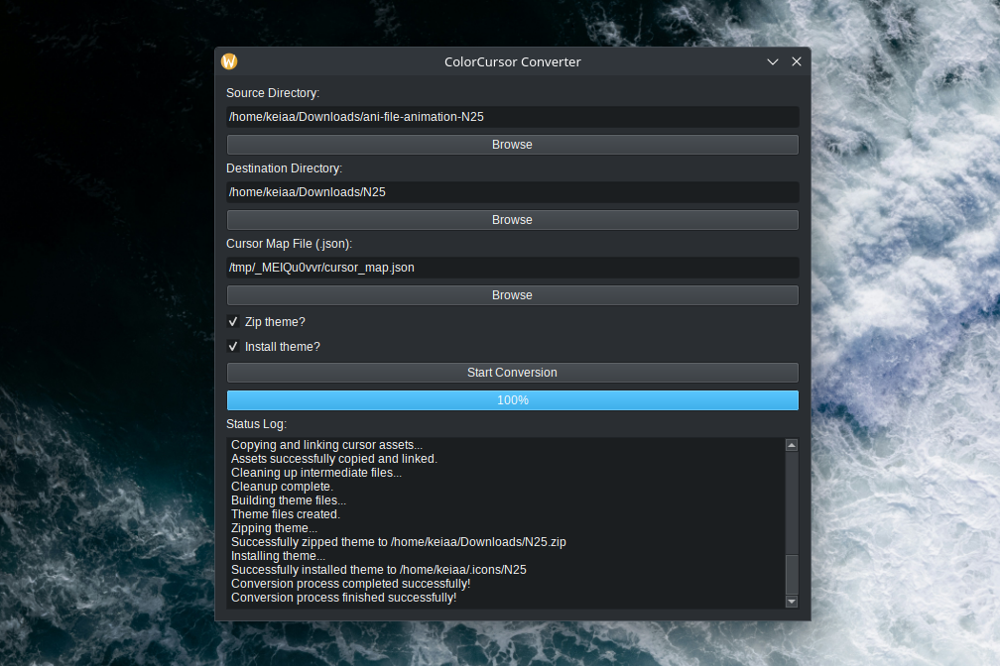

# cc.py

**cc.py** is a user-friendly GUI tool designed to convert Windows cursor themes (`.cur` and `.ani` files) into a format compatible with Linux desktop environments.

This application provides a graphical interface for converting cursors using the `win2xcur` command-line utility.

It began as a simple bash script inspired by a forum request from `safeusernameig` to convert Project Sekai cursors for Linux Mint, and has since evolved into a modular Python application built with PyQt6.

## Prerequisites

To run this application, you need to have the following installed on your Linux system:

- **Python 3:** The application is built with Python 3.
- `pip` and `venv`: This is used to manage Python packages and create a virtual environment.
- `ImageMagick`: This is required by win2xcur for processing the cursor files.
- `zip`: This is the command-line utility used for zipping files. It is typically included with your Linux distribution.